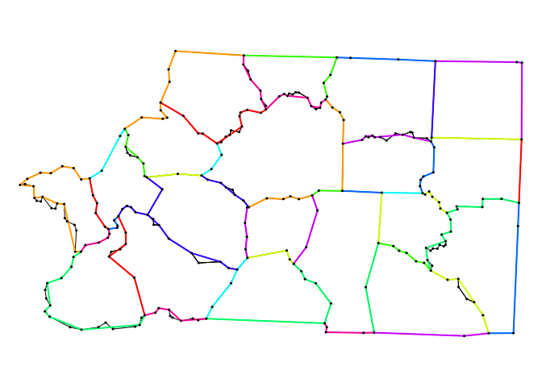
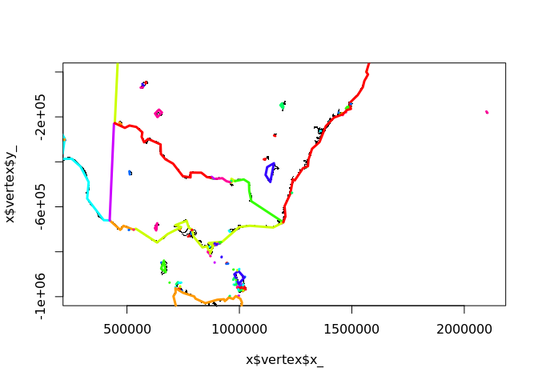
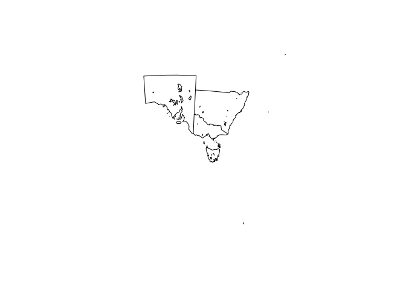

<!-- README.md is generated from README.Rmd. Please edit that file -->

# simpler

The goal of simpler is to provide the [Visvalingam
algorithm](https://bost.ocks.org/mike/simplify/) to simplifying paths.

## Installation

Only from github

## Example

Simplify a bunch of shared lines between polygons.

``` r
library(simpler)
library(silicate)
#> 
#> Attaching package: 'silicate'
#> The following object is masked from 'package:stats':
#> 
#>     filter
x <- ARC(inlandwaters)

get_pts <- function(x, i) {
  x$arc_link_vertex %>% dplyr::filter(arc_ == x$object_link_arc$arc_[i]) %>% 
    dplyr::inner_join(x$vertex, "vertex_") %>% dplyr::select(x_, y_) %>% as.matrix()
}
plot(x)
```



``` r
sfx <- vector("list", nrow(x$object_link_arc))
plot(x$vertex$x_, x$vertex$y_, pch = ".", asp = 1, xlim = c(4e5, 2e6), ylim = c(-1e6, 0))
for (i in seq_along(x$object_link_arc$arc_)) {
 pts <- get_pts(x, i)
 path <- simplify_path(pts, keep_pc = 0.01)
 lines(path, col = rainbow(10)[i %% 10 + 1], lwd = 3)
 sfx[[i]] <- sf::st_linestring(path)
}
```



``` r

## this is a cheat because the polygons have to store any shared boundaries twice, 
pryr::object_size(sf::st_sfc(sfx))
#> 115 kB
pryr::object_size(inlandwaters)
#> 586 kB


plot(sf::st_sfc(sfx))
```


