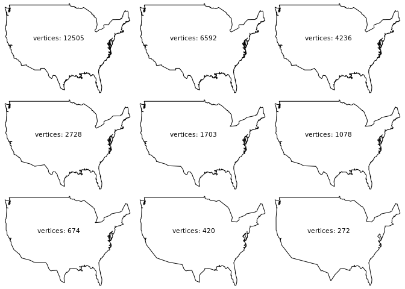
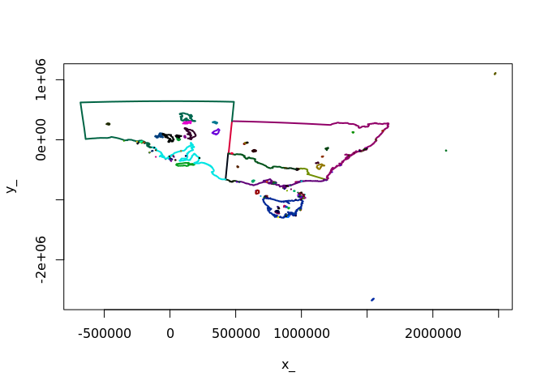
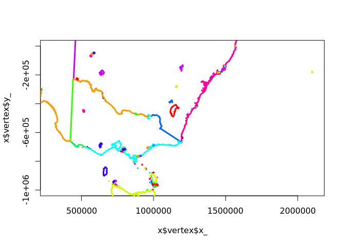

<!-- README.md is generated from README.Rmd. Please edit that file -->

# simpler

The goal of simpler is to provide the [Visvalingam
algorithm](https://bost.ocks.org/mike/simplify/) to simplifying paths.

Very much WIP\!

TODO:

  - distinguish shared boundaries from isolated lines, and drop short
    one

  - provide methods for various formats, especially polygons to shared
    boundaries

  - methods to recompose shared paths as polygons

  - 
    
    <del>
    
    avoid recalculating every triangle area every iteration
    
    </del>
    
    fixed by vectorizing *removal*, rather than tricky in-place
    re-indexing

Notes:

  - calculating triangle area is fast, the slowness comes from iterating
    over removals of focal points
  - how to avoid intersections that might occur (need examples)

## Installation

You can install this **R** package with **remotes** using:

``` r
remotes::install_github("mdsumner/simpler")
```

If you don’t have the **remotes** package, that can be installed with:

``` r
install.packages("remotes")
```

## Example

The USA example, from Natural Earth. See
<https://bost.ocks.org/mike/simplify/>

``` r
library(simpler)
w <- rnaturalearth::ne_countries(scale = 10, country = "United States of America", returnclass = "sf")
x <- w$geometry[[1]][[1]][[1]]


op <- par(mfrow = c(3, 3), mar = rep(0, 4))
plot(x, type = "l", axes = FALSE)
text(-100, 40, sprintf("vertices: %i",  nrow(x)))
for (kpc in c(0.4, rep(0.6, 7))) {
  x <- simplify_path(x, keep_pc = kpc)
  plot(x, type = "l", axes = FALSE)
  text(-100, 40, sprintf("vertices: %i",  nrow(x)))

}
```



``` r

par(op)
```

Simplify a bunch of shared lines (need better examples).

``` r
library(sf)
#> Linking to GEOS 3.6.2, GDAL 2.3.2, PROJ 4.9.3
library(silicate)
#> 
#> Attaching package: 'silicate'
#> The following object is masked from 'package:stats':
#> 
#>     filter
get_pts <- function(x, i) {
  x$arc_link_vertex %>% dplyr::filter(arc_ == x$object_link_arc$arc_[i]) %>% 
    dplyr::inner_join(x$vertex, "vertex_") %>% dplyr::select(x_, y_) %>% as.matrix()
}
nc <- read_sf(system.file("gpkg/nc.gpkg", package = "sf"))

nc1 <- nc[c(1, 2, 3, 10, 19, 18, 23, 25, 22, 34, 41, 42, 32, 34, 41, 39, 50, 43, 46, 52), ]
x <- ARC(nc1)
sfx <- vector("list", nrow(x$object_link_arc))
op <- par(mar = rep(0, 4))
#plot(x$vertex$x_, x$vertex$y_, pch = ".", asp = "")
plot(nc1$geom, reset = FALSE)
for (i in seq_along(x$object_link_arc$arc_)) {
  pts <- get_pts(x, i)
    path <- simplify_path(pts, keep_pc = 0.1)
  
  lines(path, col = rainbow(10)[i %% 10 + 1], lwd = 2)
  sfx[[i]] <- sf::st_linestring(path)
}
par(op)
points(x$vertex$x_, x$vertex$y_, pch = 19, cex = 0.3)
```


``` r


x <- ARC(inlandwaters)
plot(x)
```



``` r
sfx <- vector("list", nrow(x$object_link_arc))
plot(x$vertex$x_, x$vertex$y_, pch = ".", asp = 1, xlim = c(4e5, 2e6), ylim = c(-1e6, 0))
for (i in seq_along(x$object_link_arc$arc_)) {
 pts <- get_pts(x, i)
 path <- simplify_path(pts, keep_pc = 0.001)
 lines(path, col = rainbow(10)[i %% 10 + 1], lwd = 3)
 sfx[[i]] <- sf::st_linestring(path)
}
```



``` r

## this is a cheat because the polygons have to store any shared boundaries twice, 
pryr::object_size(sf::st_sfc(sfx))
#> 332 kB
pryr::object_size(inlandwaters)
#> 586 kB


plot(sf::st_sfc(sfx))
```


